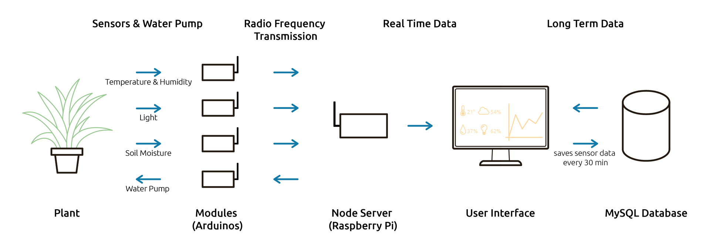
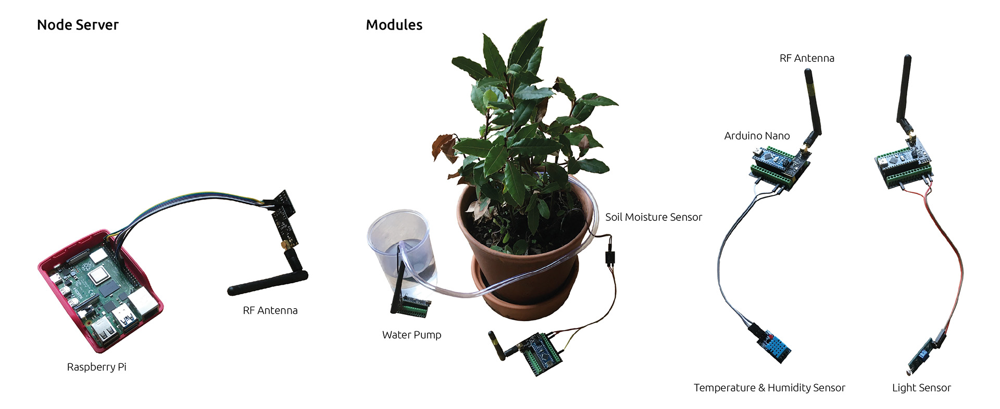
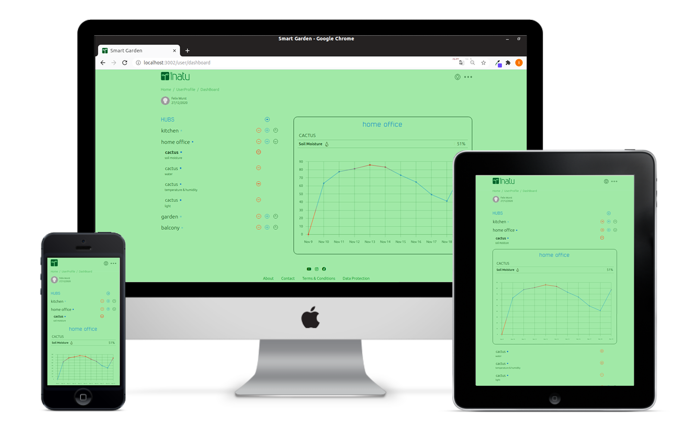

# Project: Smart Garden

### Live Demo:

[Smart Garden](https://garden.felixwurst.de/)

If you just want to try out the app and don't want to register right away, you can use this login:  `Username: felix / Password: 123`

### Description:

This project is a web-based platform about plants and their cultivation. The main focus is on the application to control plant breeding.

Various devices are used for this purpose. Individual modules (Arduino Nano) are equipped with different sensors or a water pump and communicate wirelessly with a main device (Raspberry Pi).

### Interface:

A colour theme inspired by the plant world divides the platform into different areas that are oriented towards their life cycle. Visually, the interface is meant to look less technical, more like a printed guide.

After creating an account, the user registers a master device to access its dashboard via the internet. If the serial number is correct, he can add modules, such as a soil moisture sensor, which are connected to the hub via RF. The current measured value and previously saved ones in the database (this happens every 30 minutes) are shown on the display. Now the user can monitor the growth of his plants through the use of different sensors and water pumps.

### Tools:

For the frontend application we used React. The interface uses the functionality of Reactstrap and Bootstrap, but the design was developed entirely in SCSS. On the backend side, we installed Node.js and use a MySQL database. For real-time information, the devices communicate with the application via WebSocket using Socket<n/>.io.

Frontend:
- HTML
- SCSS
- Bootstrap & Reactstrap
- React & Redux
- Chart.js

Backend:
- Node.js
- Express.js
- MySQL

Real-time information:
- Socket<n/>.io

Devices:
- Raspberry Pi
- Arduino Nano

### In Progress:

- integrate further services, such as a gallery, a shop, a blog or a chat
- optimised templates for different types of plants
- link additional functions to the modules, e.g. controllable light
- develop devices into a product

### Usage:

1. download the code
2. import sql file from the share folder into your database
3. run `npm install` & `npm run build` in your public folder
4. run `npm install` & `npm start` in your main folder
5. open your browser and go to `localhost:5000`

### Authors:

Project Team: 
- Ingo Fischer
- Hamoud Shwiri
- Felix Wurst

Teachers @ [DCI Hamburg](https://digitalcareerinstitute.org/):
- Ahmad Osman
- Mostafa Othman
